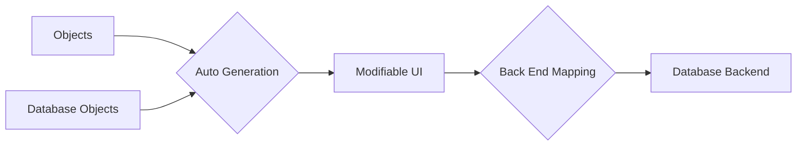

# metaphor
> A user-friendly, secure and efficient way to manage database metadata.

# About
**metaphor** aims to address the issue of creating, managing and storing user-defined metadata. In software design, it is common to overlook the value of defining a solid framework to manage metadata, usually starting as quick and dirty, and quickly evolving in a giant and cumbersome task. Metadata can become too interconnected, and modifiying any small part many times has a significant knock-on effect. Also, usually it is very painful for users to write metadata in the backend format, many times having to worry about surrogate keys, referential integrity etc. **metaphor** aims to address these issues by combining an easy to use, user-centric interface with abstracted, efficient and robust database storage.

Some of the main features of **metaphor** include:
1. _Simplified and intuitive UI:_ The user should not worry about how the meta is stored in the db, or worry about dependencies. Everything should be easily modifiable.
2. _Abstracted and efficient backend:_ The database-centric backend should be abstracted from the way it is presented to the user. It should enforce referencial integrity, be efficiently stored and fetched. Once deployed, the database representation should mimic the UI at all times, no matter the pre-existing state of the database.
3. _Auto-generation encouraged:_ There should be support for common ways to produce auto-generated metadata (ideas ranging from reading docstrings to SQL extended properties).

# Components/Interfaces

